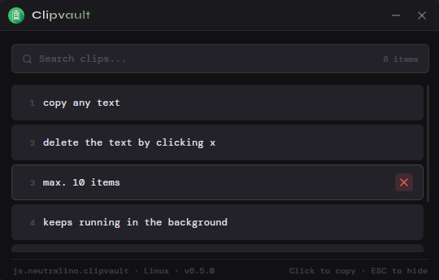

# Clipvault

A minimal clipboard history manager that lives in your system tray. Tracks your last 10 copied items, lets you search and re-copy them instantly, and stays out of your way until you need it.

Built with [Neutralinojs](https://neutralino.js.org/)


## Features

- Automatically captures everything you copy
- Stores up to 10 recent clipboard entries
- Search through your history instantly
- Click any item to copy it back to the clipboard
- Delete entries you no longer need
- Hides in the system tray when closed — keeps running in the background
- ESC to hide the window
- Persists history across sessions

## User-Interface


## Download

Grab the latest release from the [Releases](../../releases) page and download the binary for your platform


## Installation

### Linux
```bash
unzip clipvault-release.zip
chmod +x clipvault-linux_x64
./clipvault-linux_x64
```

> **Note:** On GNOME, the system tray requires the AppIndicator extension to be visible:
> ```bash
> sudo apt install gnome-shell-extension-appindicator
> ```
> Then log out and back in

### Windows
Unzip and run `clipvault-win_x64.exe`

### Mac
Unzip, then right-click the `.app` then **Open** then click **Open anyway**

> Apple blocks unsigned apps by default. This one-time bypass is required since Clipvault is not code-signed


## Usage

- **Copy anything** — Clipvault automatically picks it up in the background
- **Click an item** — copies it back to your clipboard and moves it to the top
- **Search bar** — filters your history as you type
- **Delete button** — deletes the copied content
- **ESC** — hides the window
- **System tray** — right-click the tray icon to show the window or quit


## Building from Source

**Requirements:** [Node.js](https://nodejs.org/) and the neu CLI

```bash
# Install neu CLI
npm i -g @neutralinojs/neu

# Clone the repo
git clone https://github.com/achill06/Clipvault.git
cd clipvault

# Download Neutralino binaries
neu update

# Run in development
neu run

# Build for all platforms
neu build --release --embed-resources --macos-bundle
```


## Neutralinojs Native API Usage

Clipvault was built as a practical exploration of Neutralinojs's native API surface. Here's what each API does under the hood across platforms:

| API | Used In | Description |
|---|---|---|
| `Neutralino.clipboard.readText()` / `writeText()` | `start()`, `copy_item()` | Read and write the OS clipboard |
| `Neutralino.storage.setData()` / `getData()` | `sync_to_disk()`, `load_data()` | Persist clipboard history to disk across sessions |
| `Neutralino.window.hide()` / `show()` / `minimize()` | `onWindowClose()`, tray menu, buttons | Toggle window visibility without killing the background process |
| `Neutralino.window.setDraggableRegion()` | `drag()` | Register the titlebar as a native drag handle for the frameless window |
| `Neutralino.os.setTray()` | `set_tray()` | Register the system tray icon and context menu |
| `Neutralino.os.showNotification()` | `copy_item()` | Fire a native OS notification on copy |
| `Neutralino.os.showMessageBox()` | `onTrayMenuItemClicked()` | Show a native modal dialog |
| `Neutralino.app.exit()` | `onTrayMenuItemClicked()` (Quit) | Shut down the app and background server |


## License

[MIT](LICENSE)
